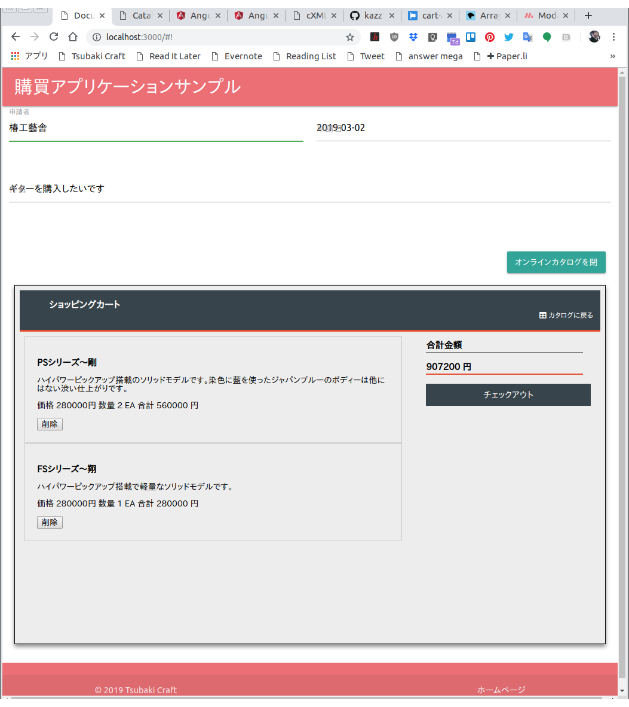

# パンチアウトカタログサーバー

## Mongoデータベースの準備

mongo cliの実行

```
> mongo
MongoDB shell version v4.0.6
connecting to: mongodb://127.0.0.1:27017/?gssapiServiceName=mongodb
Implicit session: session { "id" : UUID("37e88c03-7f6e-4ba4-aa84-e0d29c6b8227") }
MongoDB server version: 4.0.6
Server has startup warnings: 
2019-03-03T06:38:45.827+0000 I STORAGE  [initandlisten] 
2019-03-03T06:38:45.827+0000 I STORAGE  [initandlisten] ** WARNING: Using the XFS filesystem is strongly recommended with the WiredTiger storage engine
2019-03-03T06:38:45.827+0000 I STORAGE  [initandlisten] **          See http://dochub.mongodb.org/core/prodnotes-filesystem
2019-03-03T06:38:46.796+0000 I CONTROL  [initandlisten] 
2019-03-03T06:38:46.796+0000 I CONTROL  [initandlisten] ** WARNING: Access control is not enabled for the database.
2019-03-03T06:38:46.796+0000 I CONTROL  [initandlisten] **          Read and write access to data and configuration is unrestricted.
2019-03-03T06:38:46.796+0000 I CONTROL  [initandlisten] 
---
Enable MongoDB's free cloud-based monitoring service, which will then receive and display
metrics about your deployment (disk utilization, CPU, operation statistics, etc).

The monitoring data will be available on a MongoDB website with a unique URL accessible to you
and anyone you share the URL with. MongoDB may use this information to make product
improvements and to suggest MongoDB products and deployment options to you.

To enable free monitoring, run the following command: db.enableFreeMonitoring()
To permanently disable this reminder, run the following command: db.disableFreeMonitoring()
---

> 
```

catalogsデータベースを選択（データベースが存在しない場合は作られる）
```
> use catalogs
switched to db catalogs
```
コレクションを作成
```
> db.createCollection('catalog_items')
{ "ok" : 1 }
> db.createCollection('shopping_carts')
{ "ok" : 1 }
```
```
> show collections
catalog_items
shopping_carts
> 
```
テストデータの登録
```
db.catalog_items.insertOne({
    "productId": 1,
    "name": "PHシリーズ〜響", 
    "description": "Duncanのジャズピックアップ搭載のホローボディー。現代的なサウンドを奏でる使いやすいギターです。", 
    "price": 280000, 
    "uom": "EA",
    "url": "http://tsubakicraft.jp/img/hibiki.png"
    });

db.catalog_items.insertOne({
    "productId": 2,
    "name": "FSシリーズ〜翔", 
    "description": "ハイパワーピックアップ搭載で軽量なソリッドモデルです。", 
    "price": 280000, 
    "uom": "EA",
    "url": "http://tsubakicraft.jp/img/shou.png"
    });

db.catalog_items.insertOne({
    "productId": 3,
    "name": "PSシリーズ〜剛", 
    "description": "ハイパワーピックアップ搭載のソリッドモデルです。染色に藍を使ったジャパンブルーのボディーは他にはない渋い仕上がりです。", 
    "price": 280000, 
    "uom": "EA",
    "url": "http://tsubakicraft.jp/img/go.png"
    });

db.catalog_items.insertOne({
    "productId": 4,
    "name": "Lシリーズ", 
    "description": "１９世紀フランスのクラシックギターLaprevotteと同シェイプのアコースティックギターでパーラーギターと呼ばれるタイプです。1900年代初頭にMartinが製作したものに近いギターです。", 
    "price": 160000, 
    "uom": "EA",
    "url": "http://tsubakicraft.jp/img/lseries.png"
    });

db.catalog_items.insertOne({
    "productId": 5,
    "name": "Rシリーズ", 
    "description": "小柄な女性から標準的に日本人体型にちょうどいい、やや小さめのアコースティックギターです。", 
    "price": 160000, 
    "uom": "EA",
    "url": "http://tsubakicraft.jp/img/rseries.png"
    });
```

## 環境設定

Edit routes/config.js to point mongodb database.
```
const config = {
    db: {
        url: 'mongodb://172.17.0.2:27017/catalogs',
        options: {
            useNewUrlParser: true,
            reconnectTries: 60,
            reconnectInterval: 1000
        }
    }
};

module.exports = config;
```

## 実行

For development
```
npm run dev
```
For deployement
```
npm run start
```

## 生成されるPunchOutOrderMessage



```
<?xml version="1.0"?>
<cXML payloadID="456778-198@premier.workchairs.com" xml:lang="en-US" timestamp="2019-03-03T23:09:30+09:00">
  <Header>
    <From>
      <Credential domain="DUNS">
        <Identity>942888711</Identity>
      </Credential>
    </From>
    <To>
      <Credential domain="AribaNetworkUserId">
        <Identity>admin@acme.com</Identity>
      </Credential>
    </To>
    <Sender>
      <Credential domain="DUNS">
        <Identity>942888711</Identity>
      </Credential>
      <UserAgent>CatalogServer</UserAgent>
    </Sender>
  </Header>
  <Message>
    <PunchOutOrderMessage>
      <BuyerCookie>34234234ADFSDF234234</BuyerCookie>
      <PunchOutOrderMessageHeader operationAllowed="edit">
        <Total>
          <Money currency="JPY">907200</Money>
        </Total>
      </PunchOutOrderMessageHeader>
      <ItemIn quantity="2">
        <ItemID>
          <SupplierPartID>3</SupplierPartID>
          <SupplierPartAuxiliaryID/>
        </ItemID>
        <ItemDetail>
          <UnitPrice>
            <Money currency="JPY">280000</Money>
          </UnitPrice>
          <Description>ハイパワーピックアップ搭載のソリッドモデルです。染色に藍を使ったジャパンブルーのボディーは他にはない渋い仕上がりです。</Description>
          <UnitOfMeasure>EA</UnitOfMeasure>
          <Classification domain="SPSC">12345</Classification>
          <ManufacturerPartID>man-part-id</ManufacturerPartID>
          <ManufacturerName>椿工藝舎</ManufacturerName>
        </ItemDetail>
      </ItemIn>
      <ItemIn quantity="1">
        <ItemID>
          <SupplierPartID>2</SupplierPartID>
          <SupplierPartAuxiliaryID/>
        </ItemID>
        <ItemDetail>
          <UnitPrice>
            <Money currency="JPY">280000</Money>
          </UnitPrice>
          <Description>ハイパワーピックアップ搭載で軽量なソリッドモデルです。</Description>
          <UnitOfMeasure>EA</UnitOfMeasure>
          <Classification domain="SPSC">12345</Classification>
          <ManufacturerPartID>man-part-id</ManufacturerPartID>
          <ManufacturerName>椿工藝舎</ManufacturerName>
        </ItemDetail>
      </ItemIn>
    </PunchOutOrderMessage>
  </Message>
</cXML>```