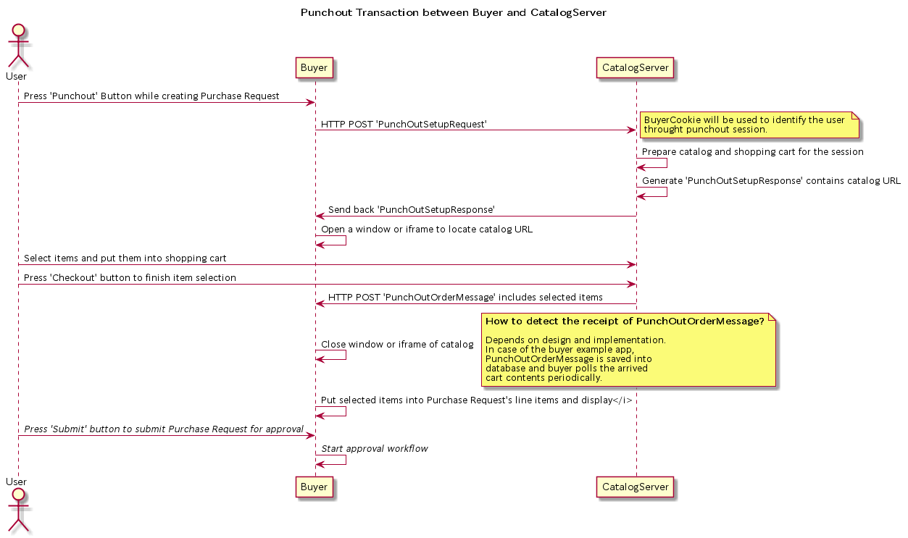

# Buyer - 購買アプリケーションサンプル

## 概要

Buyerはパンチアウトを利用して、購入する物品を選択します。

カタログサーバーに対してPunchOutSetupRequestをPOSTし、返信されたPunchOutSetupResponseに設定されているURLにアクセスします。このサンプルアプリケーションではiframeにカタログサーバーの画面を表示しています。

ショッピングカートに追加された物品はチェックアウトするとカタログサーバーはBuyerにショッピングカートの中身を設定したPunchOutOrderMessageをPOSTします。

PunchOutOrderMessageを受け取ったBuyerは何らかの方法でPOSTされたcXML文書を読み込み、ショッピングカートの中身を購入品目リストに転記し、カタログサーバーの画面を閉じます。このサンプルアプリケーションでは、1秒おきにデータベースをチェックして新しいPunchOutOrderMessageが保存されていた場合に、それを読み込んで購入品目リストに転記し、データベースに使用済フラグを更新し、iframeを非表示にしてカタログサーバーの画面を消しています。

##### Buyerからカタログサーバーにパンチアウトした様子


##### カタログサーバー上でショッピングカートに購入物品を入れた様子


##### チェックアウトしてショッピングカートの内容を表示した様子


## パンチアウトセッション



## 開発・実行環境

主要なもの。

- Npm 6.8.0
- Node 11.10.0
- Express 4.16.4
- AngularJS 1.7.7
- MongoDB driver 3.1.13
- MongoDB Server 4.0.6

## 環境設定

 Catalog-Serverを起動しておくこと。

## Mongoデータベースの準備

mongo cliの実行

```
> mongo
MongoDB shell version v4.0.6
connecting to: mongodb://127.0.0.1:27017/?gssapiServiceName=mongodb
Implicit session: session { "id" : UUID("37e88c03-7f6e-4ba4-aa84-e0d29c6b8227") }
MongoDB server version: 4.0.6
Server has startup warnings: 
2019-03-03T06:38:45.827+0000 I STORAGE  [initandlisten] 
2019-03-03T06:38:45.827+0000 I STORAGE  [initandlisten] ** WARNING: Using the XFS filesystem is strongly recommended with the WiredTiger storage engine
2019-03-03T06:38:45.827+0000 I STORAGE  [initandlisten] **          See http://dochub.mongodb.org/core/prodnotes-filesystem
2019-03-03T06:38:46.796+0000 I CONTROL  [initandlisten] 
2019-03-03T06:38:46.796+0000 I CONTROL  [initandlisten] ** WARNING: Access control is not enabled for the database.
2019-03-03T06:38:46.796+0000 I CONTROL  [initandlisten] **          Read and write access to data and configuration is unrestricted.
2019-03-03T06:38:46.796+0000 I CONTROL  [initandlisten] 
---
Enable MongoDB's free cloud-based monitoring service, which will then receive and display
metrics about your deployment (disk utilization, CPU, operation statistics, etc).

The monitoring data will be available on a MongoDB website with a unique URL accessible to you
and anyone you share the URL with. MongoDB may use this information to make product
improvements and to suggest MongoDB products and deployment options to you.

To enable free monitoring, run the following command: db.enableFreeMonitoring()
To permanently disable this reminder, run the following command: db.disableFreeMonitoring()
---

> 
```

buyerデータベースを選択（データベースが存在しない場合は作られる）。
```
> use buyer
switched to db buyer
```
コレクションを作成。
punchout_contentsコレクションにはPunchOutOrderMessageをパースした内容が保存される。
```
> db.createCollection('punchout_contents')
{ "ok" : 1 }
```
```
> show collections
punchout_contents
> 
```

## 環境設定

routes/config.js を編集してMongoDBサーバーへの接続情報を設定する。
変更するのはdb.urlのみで良い。

```
const config = {
    db: {
        url: 'mongodb://172.17.0.2:27017/buyer',
        options: {
            useNewUrlParser: true,
            reconnectTries: 60,
            reconnectInterval: 1000
        }
    }
};

module.exports = config;
```

## 実行

For development
```
npm run dev
```
For deployement
```
npm run start
```

## ブラウズ

```
http://localhost:3000
```

## PunchOutOrderMessage

カタログサーバーから受信したもの。(xml-body-parserミドルウエアでJSONに変換されたもの)

```
{
  "declaration": {
    "attributes": {
      "version": "1.0"
    }
  },
  "elements": [
    {
      "type": "element",
      "name": "cXML",
      "attributes": {
        "payloadID": "456778-198@premier.workchairs.com",
        "xml:lang": "en-US",
        "timestamp": "2019-03-04T00:04:20+09:00"
      },
      "elements": [
        {
          "type": "element",
          "name": "Header",
          "elements": [
            {
              "type": "element",
              "name": "From",
              "elements": [
                {
                  "type": "element",
                  "name": "Credential",
                  "attributes": {
                    "domain": "DUNS"
                  },
                  "elements": [
                    {
                      "type": "element",
                      "name": "Identity",
                      "elements": [
                        {
                          "type": "text",
                          "text": "942888711"
                        }
                      ]
                    }
                  ]
                }
              ]
            },
            {
              "type": "element",
              "name": "To",
              "elements": [
                {
                  "type": "element",
                  "name": "Credential",
                  "attributes": {
                    "domain": "AribaNetworkUserId"
                  },
                  "elements": [
                    {
                      "type": "element",
                      "name": "Identity",
                      "elements": [
                        {
                          "type": "text",
                          "text": "admin@acme.com"
                        }
                      ]
                    }
                  ]
                }
              ]
            },
            {
              "type": "element",
              "name": "Sender",
              "elements": [
                {
                  "type": "element",
                  "name": "Credential",
                  "attributes": {
                    "domain": "DUNS"
                  },
                  "elements": [
                    {
                      "type": "element",
                      "name": "Identity",
                      "elements": [
                        {
                          "type": "text",
                          "text": "942888711"
                        }
                      ]
                    }
                  ]
                },
                {
                  "type": "element",
                  "name": "UserAgent",
                  "elements": [
                    {
                      "type": "text",
                      "text": "CatalogServer"
                    }
                  ]
                }
              ]
            }
          ]
        },
        {
          "type": "element",
          "name": "Message",
          "elements": [
            {
              "type": "element",
              "name": "PunchOutOrderMessage",
              "elements": [
                {
                  "type": "element",
                  "name": "BuyerCookie",
                  "elements": [
                    {
                      "type": "text",
                      "text": "34234234ADFSDF234234"
                    }
                  ]
                },
                {
                  "type": "element",
                  "name": "PunchOutOrderMessageHeader",
                  "attributes":。
                    "operationA。
                  },
                  "elements": [。
                    {
                      "type": "element",
                      "name": "Total",
                      "elements": [
                        {
                          "type": "element",
                          "name": "Money",
                          "attributes": {
                            "currency": "JPY"
                          },
                          "elements": [
                            {
                              "type": "text",
                              "text": "604800"
                            }
                          ]
                        }
                      ]
                    }
                  ]
                },
                {
                  "type": "element",
                  "name": "ItemIn",
                  "attributes": {
                    "quantity": "1"
                  },
                  "elements": [
                    {
                      "type": "element",
                      "name": "ItemID",
                      "elements": [
                        {
                          "type": "element",
                          "name": "SupplierPartID",
                          "elements": [
                            {
                              "type": "text",
                              "text": "1"
                            }
                          ]
                        },
                        {
                          "type": "element",
                          "name": "SupplierPartAuxiliaryID"
                        }
                      ]
                    },
                    {
                      "type": "element",
                      "name": "ItemDetail",
                      "elements": [
                        {
                          "type": "element",
                          "name": "UnitPrice",
                          "elements": [
                            {
                              "type": "element",
                              "name": "Money",
                              "attributes": {
                                "currency": "JPY"
                              },
                              "elements": [
                                {
                                  "type": "text",
                                  "text": "280000"
                                }
                              ]
                            }
                          ]
                        },
                        {
                          "type": "element",
                          "name": "Description",
                          "elements": [
                            {
                              "type": "text",
                              "text": "Duncanのジャズピックアップ搭載のホローボディー。現代的なサウンドを奏でる使いやすいギターです。"
                            }
                          ]
                        },
                        {
                          "type": "element",
                          "name": "UnitOfMeasure",
                          "elements": [
                            {
                              "type": "text",
                              "text": "EA"
                            }
                          ]
                        },
                        {
                          "type": "element",
                          "name": "Classification",
                          "attributes": {
                            "domain": "SPSC"
                          },
                          "elements": [
                            {
                              "type": "text",
                              "text": "12345"
                            }
                          ]
                        },
                        {
                          "type": "element",
                          "name": "ManufacturerPartID",
                          "elements": [
                            {
                              "type": "text",
                              "text": "man-part-id"
                            }
                          ]
                        },
                        {
                          "type": "element",
                          "name": "ManufacturerName",
                          "elements": [
                            {
                              "type": "text",
                              "text": "椿工藝舎"
                            }
                          ]
                        }
                      ]
                    }
                  ]
                },
                {
                  "type": "element",
                  "name": "ItemIn",
                  "attributes": {
                    "quantity": "1"
                  },
                  "elements": [
                    {
                      "type": "element",
                      "name": "ItemID",
                      "elements": [
                        {
                          "type": "element",
                          "name": "SupplierPartID",
                          "elements": [
                            {
                              "type": "text",
                              "text": "2"
                            }
                          ]
                        },
                        {
                          "type": "element",
                          "name": "SupplierPartAuxiliaryID"
                        }
                      ]
                    },
                    {
                      "type": "element",
                      "name": "ItemDetail",
                      "elements": [
                        {
                          "type": "element",
                          "name": "UnitPrice",
                          "elements": [
                            {
                              "type": "element",
                              "name": "Money",
                              "attributes": {
                                "currency": "JPY"
                              },
                              "elements": [
                                {
                                  "type": "text",
                                  "text": "280000"
                                }
                              ]
                            }
                          ]
                        },
                        {
                          "type": "element",
                          "name": "Description",
                          "elements": [
                            {
                              "type": "text",
                              "text": "ハイパワーピックアップ搭載で軽量なソリッドモデルです。"
                            }
                          ]
                        },
                        {
                          "type": "element",
                          "name": "UnitOfMeasure",
                          "elements": [
                            {
                              "type": "text",
                              "text": "EA"
                            }
                          ]
                        },
                        {
                          "type": "element",
                          "name": "Classification",
                          "attributes": {
                            "domain": "SPSC"
                          },
                          "elements": [
                            {
                              "type": "text",
                              "text": "12345"
                            }
                          ]
                        },
                        {
                          "type": "element",
                          "name": "ManufacturerPartID",
                          "elements": [
                            {
                              "type": "text",
                              "text": "man-part-id"
                            }
                          ]
                        },
                        {
                          "type": "element",
                          "name": "ManufacturerName",
                          "elements": [
                            {
                              "type": "text",
                              "text": "椿工藝舎"
                            }
                          ]
                        }
                      ]
                    }
                  ]
                }
              ]
            }
          ]
        }
      ]
    }
  ]
}
```

PunchOutOrderMessageをデータベースに保存したもの

```
{
  "payloadID": "456778-198@premier.workchairs.com",
  "timestamp": "2019-03-04T10:48:09+09:00",
  "from": "942888711",
  "to": "admin@acme.com",
  "sender": "942888711",
  "userAgent": "CatalogServer",
  "buyerCookie": "34234234ADFSDF234234",
  "currency": "JPY",
  "total": 907200,
  "itemIns": [
    {
      "quantity": 1,
      "supplierPartID": "1",
      "currency": "JPY",
      "unitPrice": 280000,
      "description": "Duncanのジャズピックアップ搭載のホローボディー。現代的なサウンドを奏でる使いやすいギターです。",
      "unitOfMeasure": "EA",
      "classificationDomain": "SPSC",
      "classification": "12345",
      "manufacturerPartID": "man-part-id",
      "manufacturerName": "椿工藝舎"
    },
    {
      "quantity": 1,
      "supplierPartID": "2",
      "currency": "JPY",
      "unitPrice": 280000,
      "description": "ハイパワーピックアップ搭載で軽量なソリッドモデルです。",
      "unitOfMeasure": "EA",
      "classificationDomain": "SPSC",
      "classification": "12345",
      "manufacturerPartID": "man-part-id",
      "manufacturerName": "椿工藝舎"
    },
    {
      "quantity": 1,
      "supplierPartID": "3",
      "currency": "JPY",
      "unitPrice": 280000,
      "description": "ハイパワーピックアップ搭載のソリッドモデルです。染色に藍を使ったジャパンブルーのボディーは他にはない渋い仕上がりです。",
      "unitOfMeasure": "EA",
      "classificationDomain": "SPSC",
      "classification": "12345",
      "manufacturerPartID": "man-part-id",
      "manufacturerName": "椿工藝舎"
    }
  ],
  "updated": true,
  "_id": "5c7c83d9b4137c28d82d5ae3"
}
```

PunchOutOrderMessageを受信した際にこの内容をデータベースに保存します。そのときにupdatedをtrueに設定しています。この値がチェックアウトされた直後はtrueで、Buyerがショッピングカートの内容を転記して自画面に表示する際にfalseに更新します。