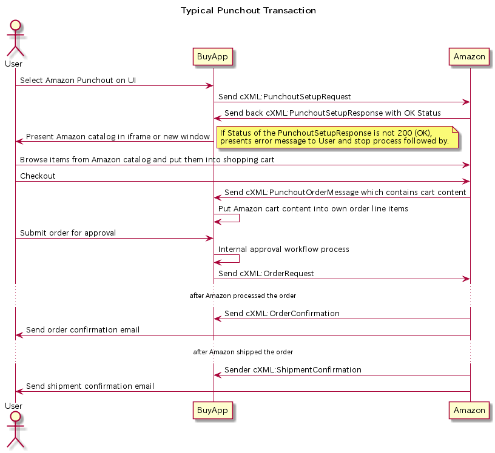
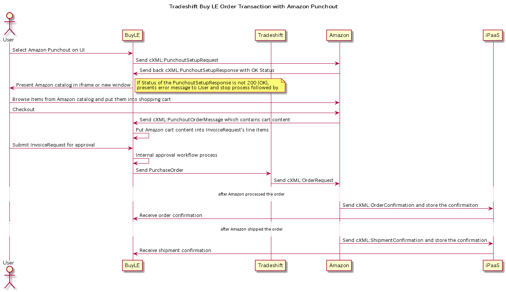

# Amazon Punchout Sequence

This document describes how amazon punchout will be processed with buying application and differences between typical punchout order transaction and Tradeshift Buy LE punchout order transaction.

## Typical Amazon Punchout Order

Typical Amazon Punchout Order is made by following cXML transactions. 

- PunchoutSetupRequest/PunchoutSetupResponse

    Prepare Amazon catalog page and shopping cart.
    User's buying application posts cXML:PunchoutSetupRequest to Amazon, then Amazon send back cXML:PunchoutSetupResponse synchronously.

- PunchoutOrderMessage

    Checkout the shopping cart and get the cart content into Buying application.
    Amazon posts cXML:PunchoutOrderMessage which carries shopping cart content to user'S buying Application.

- OrderRequest

    Send order to Amazon.
    User's buying application posts cXML:OrderRequest to place the order.

-  OrderConfirmation

    Receive order confirmation from Amazon.
    Amazon posts cXML:OrderConfirmation to user's buying application or sends email of order confirmation to buyer orgranization contact.

- ShipmentConfirmation

    Receive shipment confirmation from Amazon.
    Amazon posts cXML:ShipmentConfirmation to user's buying application or sends email of shipment confirmation to buyer organization contact.

## Tradeshift Buy LE Punchout

Tradeshift Buy LE will use 
- Tradeshift to process order instead of sending OrderRequest to Amazon.
- iPaaS to receive order confirmation and shipment confirmation from Amazon.

